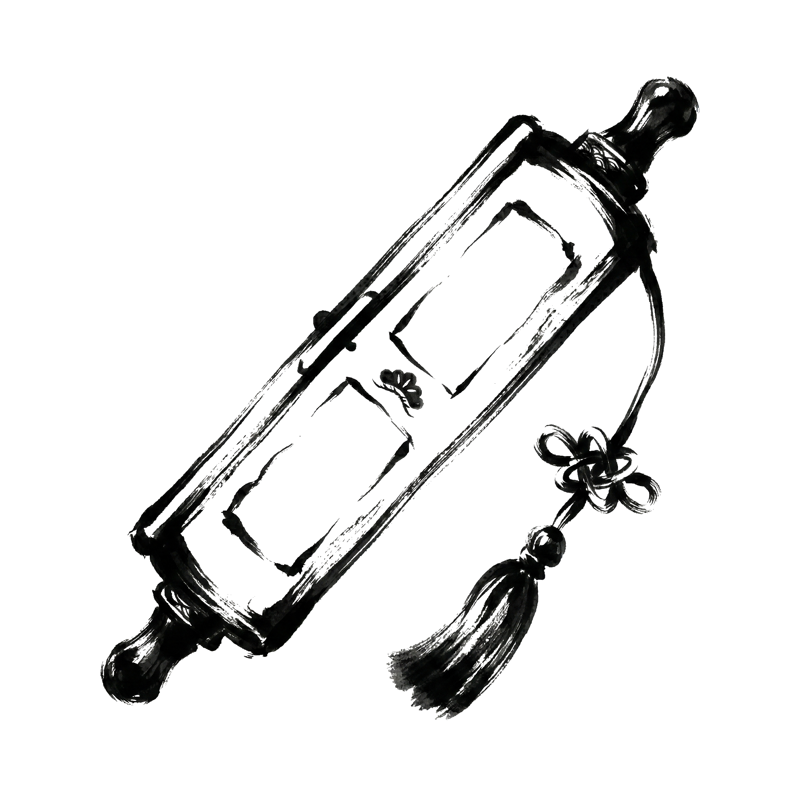

<h2 id="products" style="text-align: center; margin-top: 4rem; margin-bottom: 2rem;">Products</h2>

###  ZenClip

Just copy text and press the shortcut. Process translations, summaries, and code proofreading in the background via local Gemini CLI without ever opening a browser. **Because it routes through CLI tools provided by Google and GitHub, it uses no pay-as-you-go APIs, letting you use AI easily and affordably.**

  <a class="VPButton medium alt" href="https://github.com/saka-guchi/zen-clip">Download Free Version (GitHub)</a>
  <a class="VPButton medium brand" href="https://buy.polar.sh/polar_cl_uYQimxvpseP80yopub0uTZO2tXZqXDseLS68r0TCXBv">Buy ZenClip Pro License</a>

<a href="/zen-do/zenclip#💎-free-vs-pro-feature-comparison">→ See Free vs Pro Feature Comparison</a>

---

### 📷 ZenCull (Coming Soon)

A high-speed photo culling tool for photographers. Instantly pick the "keepers" from massive RAW datasets with AI assistance and a refined UI. 
